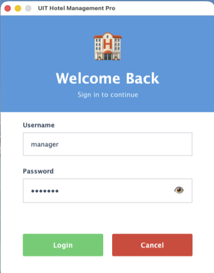

# ỨNG DỤNG QUẢN LÝ KHÁCH SẠN (Hotel Management System)

## 🎯 Giới thiệu

Đây là project môn học **Java** với đề tài:  
**Ứng dụng Quản lý Khách Sạn** – xây dựng hệ thống hỗ trợ quản lý đặt phòng, loại phòng, khách hàng, doanh thu,...

Ứng dụng được phát triển bằng **Java (SDK 25)**, sử dụng **PostgreSQL 17.6** làm hệ quản trị cơ sở dữ liệu và quản lý migration bằng **Flyway**.  
Công cụ build chính: **Maven**.

## 🛠️ Yêu cầu môi trường

Trước khi bắt đầu, bạn cần cài đặt các công cụ sau:

### 1. Java Development Kit (JDK) 25

- Tải JDK 25 tại: https://www.oracle.com/java/technologies/downloads/
- Sau khi cài đặt, kiểm tra:
  ```bash
  java -version
  ```
  Kết quả mong đợi: `java version "25..."`

### 2. Maven 3.9+

- Tải Maven tại: https://maven.apache.org/download.cgi
- Cài đặt và thêm Maven vào PATH
- Kiểm tra:
  ```bash
  mvn -v
  ```
  Kết quả mong đợi: `Apache Maven 3.9.x`

### 3. Docker Desktop

- Tải Docker Desktop tại: https://www.docker.com/products/docker-desktop/
- Docker Desktop đã bao gồm Docker Compose
- Sau khi cài đặt và khởi động Docker Desktop, kiểm tra:
  ```bash
  docker -v
  docker compose version
  ```

---

## 📂 Cấu trúc dự án

```
.
├── docker-compose.yml              # Cấu hình PostgreSQL container
├── pom.xml                         # Maven configuration
└── src
    └── main
        ├── java                    # Source code Java
        └── resources
            ├── app.properties   # Cấu hình kết nối DB & bảo mật
            └── db
                └── migration       # Flyway migration scripts
```

---

## 🚀 Hướng dẫn chạy project (Step by Step)

### Bước 1: Clone/Download project về máy

```bash
git clone <repository-url>
cd uit-java-hms
```

Hoặc download ZIP và giải nén.

### Bước 2: Khởi động Database bằng Docker

- Mở **Docker Desktop** trên máy tính.
- Mở terminal tại thư mục gốc của project và chạy:

```bash
docker compose up -d
```

**Giải thích:**

- Lệnh này sẽ tự động tải image PostgreSQL 17.6 và khởi tạo container
- Database sẽ chạy với thông tin:
  - **Host:** localhost
  - **Port:** 5432
  - **Database name:** hms
  - **Username:** postgres
  - **Password:** postgres

**Kiểm tra database đã chạy chưa:**

```bash
docker ps
```

Bạn sẽ thấy container `hms-postgres` trong danh sách với status `Up`.

### Bước 3: Chạy Migration để tạo cấu trúc database

Migration sẽ tự động tạo các bảng cần thiết trong database.

```bash
mvn flyway:migrate
```

**Lưu ý:**

- Lệnh này sử dụng thông tin kết nối đã cấu hình sẵn trong `pom.xml`
- Nếu gặp lỗi, kiểm tra Docker container đã chạy chưa (Bước 2)

**Kiểm tra migration đã chạy thành công:**

```bash
mvn flyway:info
```

Bạn sẽ thấy danh sách các migration với trạng thái `Success`.

### Bước 4: Build project

```bash
mvn clean package -DskipTests
```

**Giải thích:**

- `clean`: Xóa các file build cũ
- `package`: Build project thành file JAR
- `-DskipTests`: Bỏ qua test (dùng khi dev nhanh)

### Bước 5: Chạy ứng dụng

```bash
mvn exec:java
```

🎉 **Xong!** Ứng dụng sẽ khởi động 



Sau khi khởi động, màn hình đăng nhập sẽ xuất hiện.  
Bạn có thể sử dụng tài khoản mặc định để truy cập hệ thống:

- **Username:** `manager`
- **Password:** `manager`

👉 Đăng nhập bằng tài khoản trên để truy cập **trang quản lý chính**.  
Tại đây, bạn có thể trải nghiệm các chức năng cơ bản của hệ thống:

- Quản lý phòng (thêm, sửa, xóa, tìm kiếm)
- Quản lý loại phòng
- Đặt phòng và theo dõi tình trạng phòng
- Quản lý khách hàng
- Xem báo cáo doanh thu theo ngày/tháng

---

## 📋 Cấu hình Database (Tham khảo)

File `app.properties` đã được cấu hình sẵn:

```properties
# Database Connection
db.url=jdbc:postgresql://localhost:5432/hms
db.user=postgres
db.password=postgres

# Security
aes.hashkey=vneduuithms@2025
```

**⚠️ Lưu ý quan trọng:**

- **KHÔNG** thay đổi thông tin database nếu bạn đang dùng Docker như hướng dẫn
- Nếu cần đổi password, phải sửa cả 2 nơi:
  1. `docker-compose.yml` (biến `POSTGRES_PASSWORD`)
  2. `app.properties` (thuộc tính `db.password`)

---

## 👨‍🎓 Thông tin project

- **Môn học:** Lập trình Java
- **Đề tài:** ỨNG DỤNG QUẢN LÝ KHÁCH SẠN
- **Trường:** ĐH CNTT – UIT
- **Năm:** 2025
